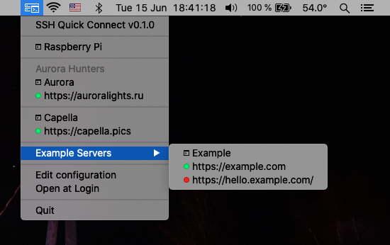

# SSH Quick Connect

Quick links for servers and sites. Checks sites health, ssl certs and domain registration. 



## Configuration 

Config is a list of objects with type and options: 

- `command` - command to be run in the terminal
- `link` - link to be opened in browser
- `separator` - horizontal line
- `label` - non-clickable item as label
- `submenu` - list of items
 
```js
module.exports = [
    {
        type: 'command',
        options: {
            title: 'Raspberry Pi',
            description: 'RPi in my home local network',
            command: 'ssh -J root@99.55.77.222:12345 -p 22222 root@localhost'
        }
    },

    { type: 'separator' },

    {
        type: 'label',
        options: {
            label: 'Aurora Hunters'
        }
    },
    {
        type: 'command',
        options: {
            title: 'Aurora',
            command: 'ssh taly@62.113.115.208'
        }
    },
    {
        type: 'link',
        options: {
            url: 'https://auroralights.ru'
        },
    },

    { type: 'separator' },

    {
        type: 'command',
        options: {
            title: 'Capella',
            command: 'ssh -p 32221 taly@capella.pics'
        }
    },
    {
        type: 'link',
        options: {
            url: 'https://capella.pics'
        },
    },

    { type: 'separator' },

    {
        type: 'submenu',
        options: {
            title: 'Example Servers',
            items: [
                {
                    type: 'command',
                    options: {
                        title: 'Example',
                        command: 'ssh root@example.com'
                    }
                },
                {
                    type: 'link',
                    options: {
                        url: 'https://example.com'
                    },
                },
                {
                    type: 'link',
                    options: {
                        url: 'https://hello.example.com/'
                    },
                },
            ]
        }
    },
];
```
